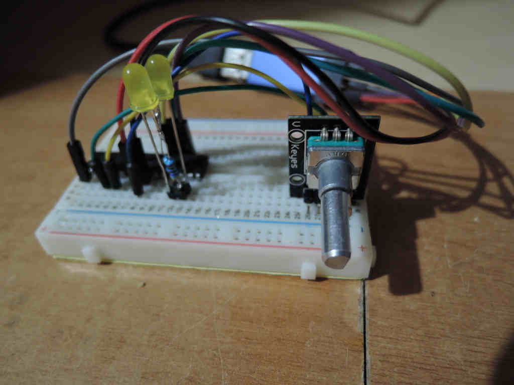

# rotary
Simple encoder rotation test

ATMEGA8, rotary encoder w/o pulled-up resistors, two leds and its resistors.
Fuses (E:FF, H:D9, L:23)

Depending of direction either one led lights or another. Nothing special.
Leds are conected between two port in anti-parallel.

